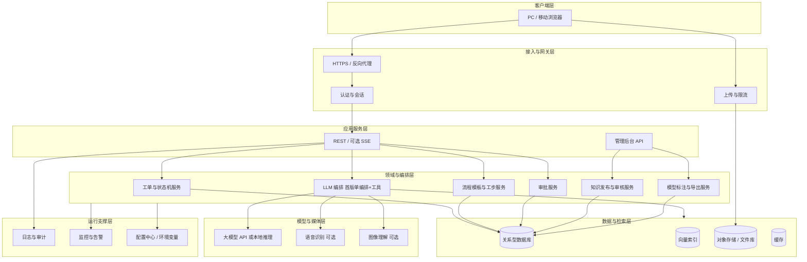
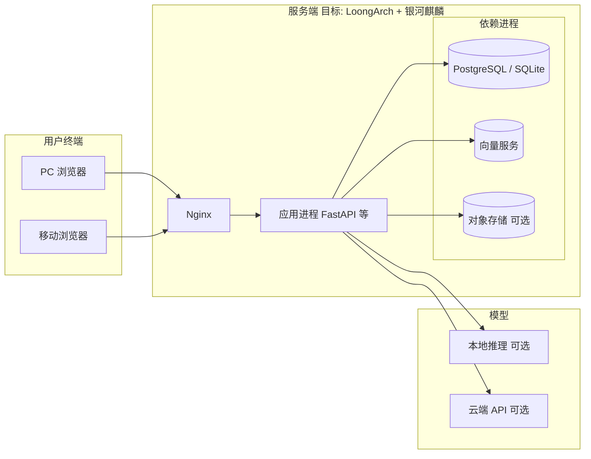

# 系统架构文档

## 文档修订记录

| 版本号 | 修订日期   | 修订人     | 修订内容摘要                                       | 审核人 |
| :----- | :--------- | :--------- | :------------------------------------------------- | :----- |
| V1.0   | 2026-04-11 | [FXL、LSY] | 初稿：逻辑/技术/部署架构，与业务场景 V2.1 及 A1 赛题对齐 | 无     |
| V1.1   | 2026-04-11 | [FXL、LSY] | 压实首版边界与默认部署、编排策略、实体清单、异常分支、安全落地与量化非功能 | 无     |

---

## 1. 文档目的

本文档描述「工业多模态检修系统」首期的**系统架构**：明确分层结构、核心组件、关键技术选型、数据与模型流、安全审计与目标部署环境，为 **`docs/MVP 产品需求文档.md`**、**OpenAPI（`/docs`）** 与 **`docs/DEPLOYMENT.md`** 提供统一技术依据。

本文档重点回答：

1. 系统采用何种总体结构（B/S、服务端划分）；
2. 多模态检索、大模型编排、工单与审批、知识沉淀在架构上如何落地；
3. 开发与目标验收环境（含 LoongArch + 银河麒麟）如何对应；
4. 非功能性能力（性能、安全、可观测性）在架构层的保障方式。

---

## 2. 适用范围与参考文档

### 2.1 适用范围

- 首期试点：**机泵类设备**辅助检修、**B/S** 交付、**先检索后生成** 的智能辅助链路；
- 覆盖：**多模态接入、语义+模糊检索、RAG、标准化作业引导、工单状态机、高危审批、知识发布、模型输出纠错与标注**（与《MVP 产品需求文档》中的 UC/FR 描述一致）。

### 2.2 参考文档

| 文档 | 与本架构的关系 |
| ---- | -------------- |
| 《MVP 产品需求文档》 | 业务功能、UC/FR、验收与 DoD |
| `docs/DEPLOYMENT.md` | 安装步骤、依赖版本、最小验收命令 |

---

## 3. 架构设计原则

1. **B/S 优先**：业务与模型能力集中在服务端，客户端以浏览器为主，便于统一发布与审计。
2. **先检索后生成**：检索层输出可溯源片段，再由大模型组织语言；未命中时禁止「无依据长文生成」。
3. **异步与可扩展**：HTTP API 与耗时推理、检索解耦；长任务支持流式反馈（如 SSE）或异步任务查询。
4. **责任边界清晰**：编排层不实现业务规则细节；工单状态、审批规则在领域服务中实现。
5. **安全默认**：鉴权、角色、高危步骤服务端强制校验；敏感配置不入库明文。
6. **目标环境可验证**：架构上允许 x86 开发构建，但依赖与镜像需规划 **LoongArch + 银河麒麟** 上的可移植路径。

---

## 4. 业务视图到技术组件映射

| 业务能力（业务文档） | 架构侧主要承载 |
| -------------------- | -------------- |
| 多模态采集（图/音/文） | 接入层：上传网关、对象存储、媒体解析（可选 ASR、图像特征） |
| 设备型号/台账 + 现象联合检索 | 检索服务：结构化查询 + 向量检索 + 关键词/模糊匹配融合 |
| RAG 与出处绑定 | 检索服务 + LLM 编排：带引用的 Prompt 组装与引用校验 |
| 标准化分步作业引导 | 领域服务：流程模板引擎 + SOP 节点序列 + 前端步骤 UI |
| 工单与状态机 | 领域服务：工单聚合、状态迁移、与检索/审批事件联动 |
| 升级会诊、高危审批 | 领域服务：会诊任务、审批流、与通知（站内信/可选消息通道） |
| 知识沉淀与版本 | 领域服务 + 管理模块：草稿/审核/发布、版本与回滚 |
| 模型输出纠错与标注 | 独立子模块：标注记录存储、导出任务、审计日志 |
| 离线保底（基础 SOP） | 客户端本地缓存 + 同步队列；或服务端预下发资源包（实现阶段选型） |

---

## 5. 逻辑架构（分层）

系统逻辑上分为 **客户端层、接入与网关层、应用服务层、领域与编排层、数据与检索层、模型与媒体层、运行支撑层**。

### 5.1 客户端层

- **PC Web**：专家会诊、审批、知识管理、标注导出、复杂信息展示。
- **移动 Web**：一线提问、拍照/录音、工步确认、结果回填；宜采用响应式或独立移动路由。

### 5.2 接入与网关层

- **TLS 终止、反向代理**（如 Nginx/Caddy）：统一域名、静态资源、限流与 gzip。
- **认证**：首版可采用 JWT + Refresh 或 Session Cookie；与角色权限中间件结合。
- **上传**：大文件直传对象存储或经服务端分片；病毒扫描与类型校验（实现阶段定稿）。

### 5.3 应用服务层

- **RESTful API**：工单 CRUD、检索对话、审批回调、知识发布、标注提交等。
- **可选 SSE/WebSocket**：长时 LLM 生成、多节点编排进度推送（与《检修业务流程》中「流式反馈」体验一致）。

### 5.4 领域与编排层

- **工单服务**：持久化工单状态编码（S1～S12、SX），保证迁移规则在服务端执行。
- **流程模板与工步服务**：按 `device_type`、`maintenance_level`、`flow_template_id` 加载工步序列，与高危标记、审批联动。
- **审批服务**：与工单步骤绑定；审批记录不可篡改（追加型日志）。
- **知识发布服务**：审核流、版本号、暂停推荐、回滚。
- **标注服务**：绑定 `message_id` / 工单 / 模型版本；导出走审批与脱敏策略。
- **LLM 编排（首版策略）**：**建议采用「单编排入口 + 工具调用」** 实现主链路——编排器顺序或条件调用「检索工具」「知识片段组装」「大模型生成」等，满足「先检索后生成」与审计需求；**不强制首版即上多智能体状态图**。当会诊分支、标注回流、多轮澄清等交互显著变复杂时，再 **演进为 LangGraph（或多节点）状态图编排**，并与 OpenAPI 中的流式事件约定对齐。现有仓库中的 LangGraph 实践可作为 **演进阶段参考**，避免首版范围与答辩演示过度绑定「多节点图」形态。

### 5.5 数据与检索层

- **关系型数据库**：工单、用户角色、SOP 定义、流程模板、审批、审计日志、标注元数据等。
- **向量索引**：对手册段落、SOP 节点、案例文本做 embedding；支持混合检索（向量 + BM25/关键词）。
- **对象存储**：原始图片、音频、附件；仅存元数据与 URL 在业务库。
- **缓存**：热点 SOP、会话上下文摘要（注意 TTL 与隐私）。

#### 5.5.1 核心实体清单（逻辑名，供数据字典对齐）

以下逻辑实体应在 ORM/Alembic 迁移中落表或落扩展字段；命名可在实现时按团队规范微调，但语义应保持一致。

| 逻辑实体 | 主要职责 |
| -------- | -------- |
| `users` | 用户账号、认证标识、基础 profile |
| `roles` / `user_roles` | 角色定义及用户-角色绑定（与权限矩阵一致） |
| `devices` | 设备台账：类型、型号、编号、安装位置等 |
| `device_components` | 可选：设备部件子表，支撑部件级检索与 SOP 关联 |
| `work_orders` | 工单主表：状态机当前状态、设备上下文、检修等级等 |
| `work_order_events` | 工单事件流水：状态迁移、工步确认、时间戳与操作者 |
| `approval_tasks` | 审批任务：绑定工单与具体工步/高危动作、结论与留痕 |
| `sop_nodes` / `sop_definitions` | SOP 定义与版本、工步 JSON 或规范化字段 |
| `flow_templates` | 流程模板：与设备类型、检修等级关联 |
| `knowledge_articles` | 可发布知识条目、审核状态、版本 |
| `retrieval_snapshots` | **检索快照**：某次回答所依据的 chunk 列表、版本号、查询向量哈希等，**与工单绑定并冻结** |
| `attachments` | 附件元数据：对象存储 key、MIME、大小、归属工单 |
| `annotations` | 模型输出纠错与标注记录 |
| `audit_logs` | 全局审计：发布、导出、权限变更、关键读敏感配置等 |

向量库中的 chunk 与业务侧 `source_document` / `chunk_id` / `sop_node_id` 的映射关系应在数据字典中单独说明。

### 5.6 模型与媒体层

- **大模型**：支持 **OpenAI 兼容 API**（如 DeepSeek）或本地 vLLM/ollama 等（以部署文档为准）；编排层统一抽象 `model_provider` / `base_url`。
- **多模态**：首版可「文本为主 + 图像 URL 传入视觉模型」；ASR 可云端或本地 Whisper 系；需在架构上预留 **可插拔适配器**，便于麒麟环境替换实现。

### 5.7 运行支撑层

- **结构化日志**：请求 ID、用户、工单号、节点名、耗时。
- **审计**：审批、知识发布、标注导出、权限变更必须可追溯。
- **监控**：进程存活、依赖健康（DB/向量库/模型）、队列积压。

### 5.8 首版实现边界：必选、可选与预留

为避免「架构大而全、实现抓不住重点」，首期开发与竞赛演示按下表收口；**预留**项允许在架构层保留接口与文档位，不要求首版闭环实现。

| 类别 | 内容 |
| ---- | ---- |
| **首版必选** | 文本 + 图片上传；设备上下文（型号/编号/台账关键字）；**语义 + 关键词/模糊** 混合检索与 RAG；出处与引用校验；工单状态机（S1～S12、SX）；高危步骤 **服务端** 审批阻断；知识 **审核后发布**（草稿/发布分离）；基础审计日志；**检索快照冻结**（见第 8 节）；B/S 与目标环境验证计划（LoongArch + 麒麟） |
| **首版可选** | 语音 **ASR** 转写；**SSE** 流式输出大模型；本地大模型推理（与云端二选一或主备）；对象存储 MinIO（简化为本地目录亦可） |
| **后续预留** | 完整 **LangGraph 多节点** 编排图（会诊/多轮分支复杂化后）；标注样本 **批量导出为训练集** 与自动化 MLOps；客户端 **离线全量同步队列**；多租户与异地多活 |

---

## 6. 技术架构（推荐选型）

以下为 **推荐组合**，实现阶段可按团队栈微调，但需在 `docs/DEPLOYMENT.md` 或团队记录中说明偏差。

| 层次 | 推荐技术 | 说明 |
| ---- | -------- | ---- |
| 运行时 | Python 3.10+ | 生态成熟，便于 LangChain/LangGraph 与异步栈 |
| Web 框架 | FastAPI | 异步原生、OpenAPI 契约、SSE 友好 |
| ORM / 迁移 | SQLAlchemy 2.0 Async + Alembic | 与现有仓库一致；SQLite 开发、PostgreSQL 生产可选 |
| 校验 | Pydantic v2 | 请求/响应与配置 |
| 向量库 | Chroma / Milvus / pgvector（择一） | 需评估 LoongArch 上二进制可用性；首版可 SQLite + 轻量向量扩展 |
| 关系库 | PostgreSQL（推荐生产） / SQLite（开发） | 事务与 JSON 字段兼顾工单与 SOP 扩展 |
| 对象存储 | MinIO 或本地文件系统 + 备份 | 竞赛环境可简化为本地目录 |
| 反向代理 | Nginx | TLS、静态前端、反代 API |
| 前端 | 纯 HTML + JS 或 Vue/React（择一） | 赛题要求可视界面；首版可延续单页 + API 模式再演进 |
| 智能体编排 | LangChain ≥ 0.2；首版 **工具调用 + 单编排**；演进可选 LangGraph | 首版与 §5.4 一致：先工具化检索与生成，复杂后再上状态图 |
| 容器（可选） | Docker / Podman | 麒麟上需验证镜像架构为 `linux/loong64` 或原生构建 |

**国产化目标环境**：服务端运行在 **LoongArch + 银河麒麟高级服务器版**；Python 与依赖需在该平台 **原生构建或官方提供 loongarch64  wheel**，避免仅含 x86 二进制导致无法运行。

---

## 7. 核心数据流

### 7.1 现场辅助检修（检索 + 生成）

1. 客户端上传 **文本/图片/录音** 与设备上下文 → 接入层鉴权与落盘（对象存储）。
2. **媒体可选处理**：ASR 转写、图像说明文本化，与原始文本合并为查询意图。
3. **检索服务**：结构化过滤（设备类型、检修等级）+ 向量检索 + 关键词模糊匹配 → Top-K 片段，附 `source_document`、`chunk_id`。
4. **编排层**：将 Top-K 注入 Prompt，调用 LLM 生成「带引用」的建议与下一步动作；若置信度不足或空命中 → 返回明确提示并建议升级。
5. **工单服务**：写入/更新工单状态（如 S2→S3），记录 **检索快照 ID**（`retrieval_snapshots`）供审计；快照内容与当时所用 SOP/知识版本 **冻结**，事后库更新不改变该工单引用口径。

**异常与降级分支（7.1）**

| 场景 | 架构处理 |
| ---- | -------- |
| 上传失败（网络/大小/格式） | 返回可重试错误码；**保留或创建工单草稿**（如仍处 S1），不推进到 S3；提示压缩/重拍 |
| 单张图片过大 | 网关/应用层拒绝（如 **> 10MB**）并提示客户端压缩，阈值见 §10 |
| 检索空命中 / 置信度不足 | **不调用长文生成**或仅返回短提示；工单可标记待升级（如 S2→S4），与业务文档一致 |
| 模型调用失败或超时 | **降级**：返回 Top-K 检索片段列表 +「模型暂不可用」说明，**HTTP 非 500**（如 200 + 业务码），避免白屏 |
| 向量库或 DB 不可用 | 健康检查失败；只读接口返回依赖错误；写操作快速失败 |

### 7.2 标准化分步作业引导

1. 客户端选择 **检修等级** 或加载默认模板 → **流程模板服务** 返回 `execution_steps` 序列。
2. 工步推进与 **高危标记** 校验在服务端执行；需审批时 **阻断** 并创建审批任务。
3. 每步确认写入工单事件表，供复盘与知识沉淀引用。

**异常与降级分支（7.2）**

| 场景 | 架构处理 |
| ---- | -------- |
| 模板不存在或设备类型不匹配 | 返回明确业务错误；禁止默认「空工步」继续；可回退到仅检索建议 |
| 前端绕过显示点击「已完成」 | **服务端**根据当前工单状态与 `approval_tasks` 再次校验；未通过审批的高危工步 **拒绝写事件** |
| 审批超时（业务约定 T 小时未处理） | 工单保持 `S6` 或按产品规则转 **待处理/提醒**；**不自动放行**；可配置中止为 `SX`（见《检修业务流程》） |

### 7.3 模型输出纠错与标注回流

1. 专家在 Web 端对指定消息片段提交标注 → **标注服务** 持久化，可选关联「候选知识修订」。
2. **导出服务**（异步任务）生成脱敏文件；记录导出审批人与时间。
3. 可选：定期将标注样本同步至评测集存储，供离线评估（非首版强制）。

**异常与降级分支（7.3）**

| 场景 | 架构处理 |
| ---- | -------- |
| 导出任务失败 | 异步任务标记失败原因；审计记录 **不删除** 重试前记录 |
| 无导出权限用户调用导出 API | **403**；不写文件 |
| 脱敏规则命中敏感字段 | 阻断导出或打码后导出，策略由知识管理员配置 |

---

## 8. 安全架构要点

| 类别 | 措施 |
| ---- | ---- |
| 传输 | 全站 HTTPS（生产）；内网演示可用自签证书并文档说明 |
| 身份与权限 | RBAC，与《MVP 产品需求文档》权限与 UC 对齐；接口级鉴权 |
| 数据 | 敏感字段脱敏；对象存储 URL 带时效签名；备份策略见部署文档 |
| 大模型 | 提示词注入防护；输出侧引用白名单；高危话术规则拦截 |
| 审计 | 审批、发布、标注、导出、权限变更全量审计；日志防篡改（追加写） |

### 8.1 与检修业务强相关的架构约束

1. **高危步骤二次校验**：前端可灰显按钮，但 **每一次推进工步或执行动作的 API** 必须在服务端再次校验：当前工单状态、绑定 `approval_tasks` 是否已通过、操作者与角色是否匹配。**禁止仅依赖前端隐藏。**
2. **知识发布权限隔离**：**专家/班长** 可「审核通过/驳回内容」；**知识管理员** 执行「发布、回滚、下架」等对外可见状态变更。两类动作在 API 与表权限上 **拆分**，避免「一人包办」。
3. **工单引用快照冻结**：每次产生辅助建议时，持久化 **检索快照**（chunk id、知识版本、SOP `version`）；工单复盘与责任追溯以快照为准，**事后知识库更新不得追溯改写历史工单已冻结的引用内容**（与 §7.1 第 5 步一致，此处为安全强条）。

---

## 9. 部署架构（B/S + 目标平台）

- **单机一体化部署**（竞赛常见）：Nginx + 应用 + 数据库/向量库同机；资源紧张时向量检索可降配或缩小索引规模。
- **开发环境**：可在 Windows/x86 Linux 上运行同一套容器或进程；**交付前**在目标麒麟机器完成一次全链路构建与冒烟测试，并归档报告。

### 9.1 首版默认部署方案（收口）

竞赛与首版演示 **默认采用** 以下组合，减少「可选项过多」带来的实现分叉；其它选项视为替换或扩展，须在 `docs/DEPLOYMENT.md` 或团队记录中单独论证。

| 组件 | 首版默认 |
| ---- | -------- |
| 前端 | 单页 Web（PC/移动响应式或双入口均可） |
| 应用 | **FastAPI 单体** 进程承载 REST（及可选 SSE） |
| 关系库 | **SQLite**（开发与小规模演示）/ 目标环境可切换 **PostgreSQL**（与 Alembic 迁移一致） |
| 向量检索 | **Chroma** 或 **pgvector 二选一**（团队选定其一后全项目统一，并在麒麟环境验证） |
| 文件存储 | **本地目录**（按日期/工单分桶），不上 MinIO 亦可交付 |
| 大模型 | **云端 OpenAI 兼容 API** 为主（如 DeepSeek）；本地推理为可选 |
| 反向代理 | **Nginx** + TLS 终止 + 反代 `/api` 与静态资源 |
| 拓扑 | **单机同机**：Nginx、应用、DB/向量在同一台验收机 |

**目标验收环境**：**LoongArch + 银河麒麟高级服务器版** 为硬约束；首版默认方案须在该环境完成 **至少一次** 端到端冒烟（登录—提问—检索—出处的链路 + 工单创建），结果写入部署报告。

---

## 10. 非功能需求在架构上的体现

### 10.1 量化指标与架构对策（与业务验收对齐）

下列数值为 **首版架构承诺口径**，可与《MVP 产品需求文档》验收章节及 `backend/tests/` 结果对齐；若环境受限，允许在团队记录中分环境披露偏差。

| 指标 | 目标值 | 架构对策 |
| ---- | ------ | -------- |
| 首条可用建议响应时间 | **≤ 3 s**（P95，不含用户网络极差场景） | 检索并行、热点缓存、控制 Prompt 长度；LLM 可流式首包 |
| 单次图片上传大小 | **≤ 10 MB** | 网关/应用层校验；超限友好错误 |
| 审批写库与状态更新 | **≤ 500 ms**（P95，同机部署） | 审批与工单事件同事务或短事务；避免同步调用外部 HTTP |
| 模型不可用 | 不得对客户端表现为 **500 裸错** | 降级为仅返回检索片段 + 业务码；见 §7.1 |
| 审计日志保留 | **≥ 180 天**（可配置；演示环境可缩短但须注明） | 日志轮转与归档策略；DB 审计表分区或定期导出 |
| 来源可追溯率 | **= 100%**（业务要求） | 无检索命中则短回复，禁止无引用长生成 |

### 10.2 其它非功能

| 非功能 | 架构对策 |
| ------ | -------- |
| 可用性 | 健康检查接口；依赖熔断与降级（见上表） |
| 可维护性 | OpenAPI 契约、分层与模块边界、配置外置 |
| 可观测性 | 请求 ID、结构化日志、基础指标（QPS、延迟、错误率） |
| 可移植性 | 依赖抽象（存储、向量、模型客户端接口），便于 LoongArch 替换实现 |

---

## 11. 与现有代码仓库的关系（说明性）

当前仓库已实现 **FastAPI + LangGraph 多智能体 + SSE** 的工业时序诊断示例（传感器统计查询 + 诊断报告）。与本检修系统的架构 **在工程模式上兼容**（B/S、异步服务、可流式），但 **领域模型不同**：检修系统以工单、SOP、RAG、审批为主，时序诊断为可选扩展子域。下表区分 **代码级复用**、**设计经验复用** 与 **需从零实现**，便于排期与答辩表述。

| 类型 | 内容 |
| ---- | ---- |
| **可直接复用的代码级模块（或经薄封装即可）** | `FastAPI` 应用骨架、`Pydantic Settings` 配置模式、`SQLAlchemy 2.0 AsyncEngine` 与 Alembic 迁移范式、健康检查路由模式、`SSE`/`EventSource` 响应模式（若首版启用流式）、HTTP 客户端与超时/重试工具函数等 |
| **可复用的设计经验（非业务代码照搬）** | 异步路由不写阻塞 IO、Repository/Service 分层思路、LLM `model_provider` 工厂与密钥管理、LangGraph **状态图设计经验**（留作演进）、pytest 异步测试与 Mock 策略 |
| **需从零实现（检修域）** | 工单状态机与 `work_order_events`、流程模板与工步推进 API、`retrieval_snapshots` 与混合检索管道、知识审核/发布工作流、`approval_tasks` 与高危二次校验、标注与导出、设备台账与权限矩阵的完整 CRUD 等 |

**文档与路由约定**：对外 HTTP 契约以运行中的 **OpenAPI**（`/docs`）为准；检修域路由前缀（如 `/api/v1/maintenance/...`）与既有 `/api/v1/diagnose` 并列，避免「一套服务、多套语义」却无说明。

---

## 12. 后续文档输入输出

仓库 `docs/` 已收敛为少量核心文档；详细接口字段与用例以 **Swagger/OpenAPI** 与 **`backend/tests/`** 为准。

| 后续产出 | 本架构文档提供 |
| -------- | -------------- |
| 《MVP 产品需求文档》 | 功能 ID、P0/P1 边界、与 UC 映射，为接口与页面拆分提供清单 |
| OpenAPI（`/docs`） | 资源划分、同步/流式接口类型、请求响应模型 |
| `docs/DEPLOYMENT.md` | 单机/容器部署步骤与最小验收 |

---

## 13. 术语与缩写

| 术语 | 含义 |
| ---- | ---- |
| B/S | 浏览器/服务器架构 |
| RAG | 检索增强生成 |
| SSE | Server-Sent Events，服务端推送事件流 |
| LoongArch | 龙芯 64 位指令架构 |
| 银河麒麟 | 银河麒麟高级服务器操作系统（赛题指定服务端 OS 系列） |

---

## 14. 修订策略

当《MVP 产品需求文档》发生 **跨版本** 变更（如新增子系统、变更目标平台）时，应同步更新本架构文档的 **第 4～8、9～10 章及 §5.5.1、§5.8** 并递增修订记录版本号。
